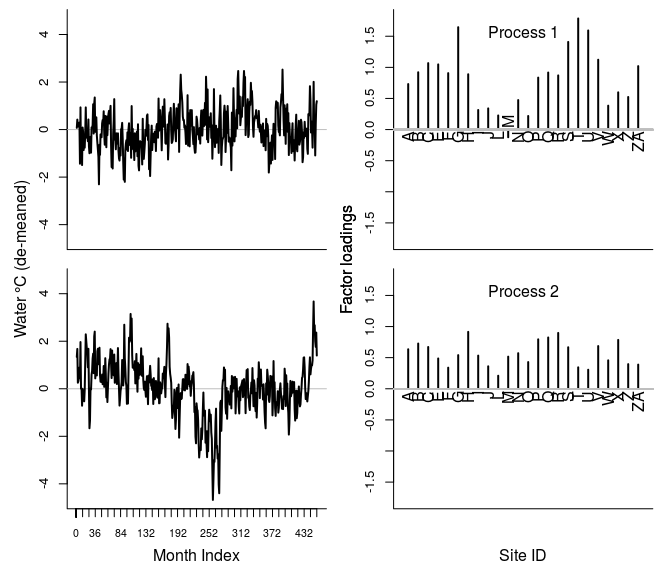
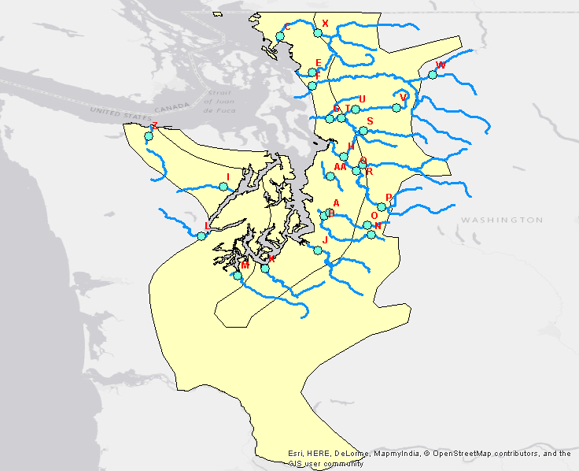
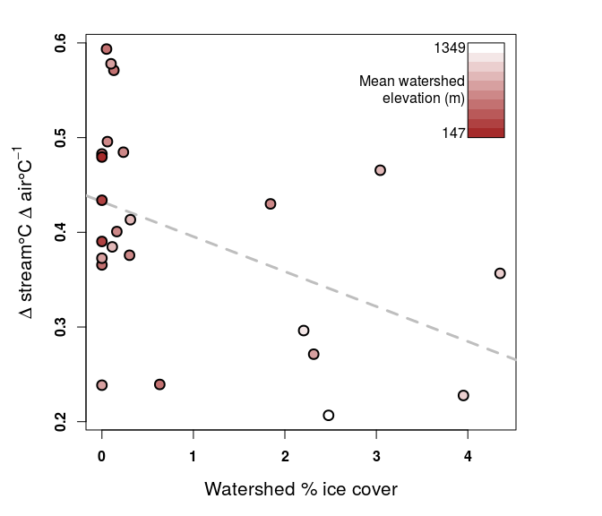
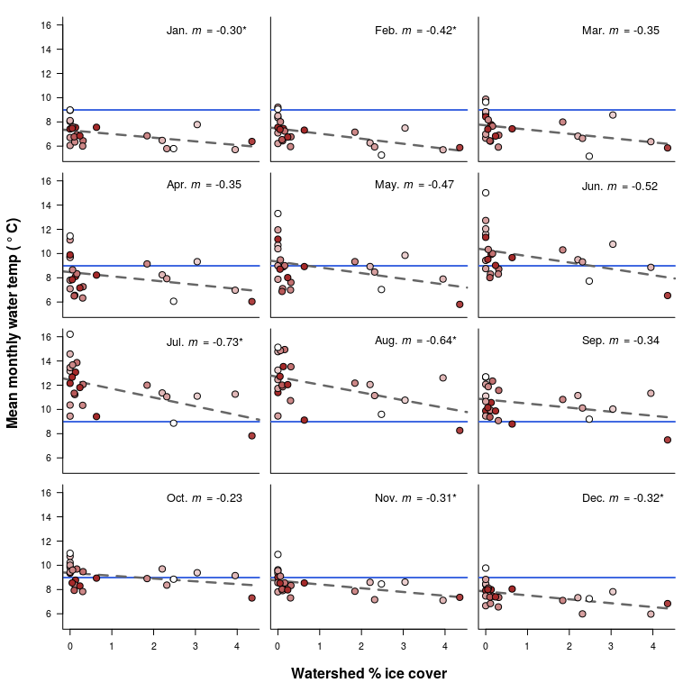

# Puget Sound rivers DFA

## Background
+ The temperature of a river governs what types of plants and animals can live within it. This in turn determines the role of that river within the broader environment, as well as its value to people.
+ River temperature is primarily determined by the temperature of the surrounding air, meaning river temperature is largely controlled at a regional scale. I'll call this relationship "water-air temperature coupling."
+ Characteristics of a particular watershed, like slope, area, and elevation might cause some rivers to be less strongly coupled to air than others.
+ If I can identify these watershed factors, I can predict which rivers will see greater temperature changes under projected climate change scenarios.

## Goals
+ Model historical water temperature for a sampling of rivers around Puget Sound, Washington state, USA.
+ Relate water temperature to regional average air temperature for the same time span.
+ Identify watershed factors that account for decoupling of water and air temperature.

## Approach
+ Dynamic Factor Analysis is a technique for identifying a small number of trends that summarize a large number of time series.
+ It is a special case of a state-space model design, where underlying processes (_true_ water temperature) and observations of those processes (_observed_ temperature) are modeled separately. Here, instead of modeling each river's temperature as an individual process, it uses random walks to generate a few processes ("common trends") that resemble as many observed series as possible. 
+ Air temperature and seasonal effects are included as covariates in the observation component. Any variation in water temp not accounted for by the covariates loads onto the common trends, which may represent one or more watershed-scale drivers of water temp.
+ By evaluating the effects of the covariates and the common trends, region-scale and watershed-scale drivers can be teased apart!

xt = xt-1 + wt

yt = Zxt + Ddt + vt

xt (the common trends at time t) depends on x from the previous time step and some normal error, wt. This is the definition of a random walk. yt contains the observed water temperature data at time t. Z contains the factor loadings that relate each observation to each common trend. D and d are effect sizes (change in water temperature per change in air temperature) and covariates (here air temperature and some seasonal factors to estimate), respectively. Finally, vt represents observation error. 

## Data
+ Monthly time series of water temperature from 24 streams emptying into Puget Sound (1978-2015).
+ Monthly time series of air temperature for Washington climate divisions 3 and 4 (Puget Sound region).
+ Watershed areal data from NHDPlusV2, NLCD2011, STATSGO, and NADP, representing land use, lithography, census data, and more.

## Report

First, here's a  of the Puget Sound region, with water temperature monitoring sites as red dots. The colored topography shows the area corresponding to our average air temperature data.

Note that the water temperature series have been centered (de-meaned) so that differences in absolute temperature between streams will not effect the model outcome. These series have *not* been scaled due to a curiosity of DFA design for which I won't go into detail here. Air temperature has been centered and scaled, mainly in the interest of comparing effect sizes between covariates (In other models I have included precipitation, heating degree days, etc.).

Also, I'm using the terms "stream" and "river" interchangeably.

### Model fits and residuals

It's crucial to make sure your model fits the data. Here's an example model fit for one of the rivers, along with the residuals for that fit. The black line in the upper plot shows the common trend that best represents this time series, while the gray line shows the overall fit, including common trend, covariate, and seasonal effects. The residuals are evenly dispersed about the fitted model, and while there appears to be slightly higher residual variance toward the beginning of the time series, additional tests show this to be statistically non-significant.

### Estimated common trends and their factor loadings

Model selection via AIC determined that 2 was the optimum number of common trends to represent the 24 time series. Here are the trends and their loadings:

At this point, the trends represent watershed attributes that account for variation in stream temperature *not* explained by regional air temperature. The loadings indicate the degree to which each stream's temperature can be represented by the corresponding common trend. I've left the site names off the map above, but you can see them in the uglier map below. (Note that ZA is referred to as AA on this map).

### Water-air temperature coupling

Now let's see which streams show the highest coupling between water temperature and the regional air temperature. To do this, we'll look at the effect sizes of the covariate (air temperature) with respect to each river. Coupling should be thought of as change in the response (water temperature) per unit change in the covariate (air temperature), which is the definition of an effect size.

I used regression analysis to determine the watershed attribute that best accounted for variation in water-air temperature coupling. Candidates included watershed area, average watershed slope and elevation, and several metrics of human land use and urbanization. The best predictors all related to elevation, with the percentage of permanent ice in each watershed (essentially glaciation) being the best predictor of all. Here's a plot of coupling (y) versus ice cover (x):

.

Watersheds with more permanent ice have streams that are less coupled to air temperature!

### Watershed predictors of de-coupling

I mentioned that there were 2 common trends identified. These trends represent additional sources of variation that explain the water temperature trends over time. Any variation explained by the common trends was *not* accounted for by the covariates, so these trends should correspond to various sub-regional influences on water temperature. Let's see which watershed attributes correlate best with the common trends! Here are the six best predictors of trend 1:

 

Asterisks indicate significant slopes. Point color shows relative elevation (red=high, blue=low). Here's trend 2:

It looks like mean annual runoff shows the strongest positive loading onto common trend 1, suggesting a connection between discharge (volume of river flow per unit time) and water-air decoupling. Naturally, if a river has more water in it, it will be more difficult to heat and cool, and the model has captured this fact! The percentage of watershed lithography classified as "coastal alluvium" is also positively loaded. This type of material is characteristic of coastal lowlands, suggesting a possible connection between overall proximity to the marine layer of Puget Sound and water-air decoupling. Of course, further analysis will be necessary before these conclusions will have any weight. Take a look at the other watershed variables in the graph and see whether you can interpret them in the context of the study.

As for trend 2, none of the watershed variables have significant slopes when regressed against it. This could either mean there are variables I missed, or that trend 2 represents some other source of variation entirely. It could even be random error, though ideally all the random error would be "soaked up" by the error terms in the DFA equations.

### Seasonal breakdown of ice vs. water temperature

 

This figure shows the relationship between the percentage of watershed area covered in permanent ice (glaciation) and mean monthly water temperature over the entire 1978-2015 time series. You can see that watersheds with more glacial ice (and certainly more snowfall) are consistently colder than those with less. Asterisks denote significant slopes. You can also trace the seasonal change in temperature if scan through the plots in order. It fluctuates cyclically around the yearly mean temperature, represented by the blue line. More interestingly, this figure shows that the steepest slopes occur in July and August, when the cooling effect of ice is most pronounced. I'm currently adding interaction effects to the model that will allow me to see the seasonal change in *coupling*, rather than just raw temperature.

### Conclusions

This is a work in progress, but it's clear that stream temperature in glaciated watersheds is less strongly coupled to air temperature, due to the contribution of melting ice to stream flow. It also appears that discharge and average areal proximity to the warmth of Puget Sound could be important factors in causing de-coupling. Stay tuned for more!

Contact Mike Vlah at:
+ vlahm13@gmail[dot]com
+ [github.com/vlahm](https://github.com/vlahm)
+ [linkedin.com/in/michaelvlah](https://www.linkedin.com/in/michaelvlah)
